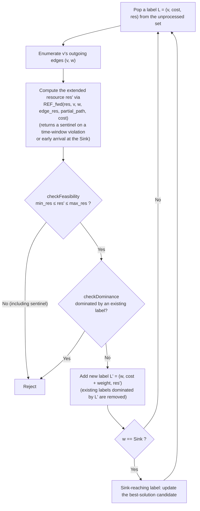

# Solving TSPTW Exactly with a Custom REF in cspy — A Teaching Guide

Code: [`tsptw_cspy.py`](./tsptw_cspy.py)
Audience: students who already know the basics of OR (shortest paths, dynamic
programming, branch and bound) but are new to cspy, ESPPRC, and labelling
algorithms
Environment: `cspy` v1.0.3 (C++ bindings) + `networkx` + `numpy` (installed in
`/Users/azzqi/workspace/cspy/.venv`)

---

## 1. Overview

This example solves the Traveling Salesman Problem with Time Windows (TSPTW)
exactly using the Resource Constrained Shortest Path (RCSP) solver **cspy**,
**without modifying it at all**. The key is cspy's public **custom Resource
Extension Function (REF) callback mechanism** (`cspy.REFCallback`).

By the end, you should be able to:

- Formulate the reduction of TSPTW to RCSP (more precisely, ESPPRC: the
  Elementary Shortest Path Problem with Resource Constraints)
- Override `REFCallback.REF_fwd` to implement the propagation of time windows
  (waiting, deadlines)
- Understand how the **dominance** rule of labelling algorithms can become
  unsound in a setting where "not every elementary path is feasible," and the
  technique that restores soundness (the visit-flag resources)
- Avoid cspy-specific pitfalls (degenerate paths, the meaning of `min_res`,
  the contents of `partial_path`, etc.)

This also serves as preparation for solving the pricing problem of column
generation / Branch-and-Price (ESPPRC-TW) with cspy (Section 8).

## 2. Definition of TSPTW

We are given a depot 0 and customers $1, \dots, n$. All symbols correspond to
field names in the code.

| Symbol | Code | Meaning |
|---|---|---|
| $t_{ij}$ | `travel[i][j]` | travel time from node $i$ to $j$ (asymmetric) |
| $[a_i, b_i]$ | `tw_a[i]`, `tw_b[i]` | the time window of customer $i$ |
| $s_i$ | `service[i]` | the service time of customer $i$ (the depot has $s_0 = 0$) |
| $T_i$ | `res[1]` (below) | the **service start time** at node $i$ |

**Problem**: departing from the depot at time 0, visit every customer exactly
once and return to the depot; among all permutations
$\pi = (\pi_1, \dots, \pi_n)$, find the one that minimizes the total travel
time

$$
\min_{\pi} \; \sum_{k=0}^{n} t_{\pi_k \pi_{k+1}} \qquad (\pi_0 = \pi_{n+1} = 0)
$$

Times are propagated by the following recursion (when visiting $j$ right
after $i$):

$$
T_j = \max\bigl(a_j,\; T_i + s_i + t_{ij}\bigr), \qquad T_j \le b_j
$$

- $T_i + s_i + t_{ij}$ is the **arrival time**. If it arrives earlier than
  $a_j$, it **waits** until $a_j$ (this is what the $\max$ expresses).
- A visit that arrives after $b_j$ is **infeasible** (the deadline is a
  constraint on the service start time).
- Waiting time and service time are **not included in the cost** (the
  objective is total travel time only).

This $T_j = \max(a_j, T_i + s_i + t_{ij})$ corresponds directly to the
`REF_fwd` implementation shown later,
`start = max(nd_head["tw_a"], arrival)`.

## 3. Reduction to RCSP / ESPPRC

### 3.1 Splitting into Source/Sink and the Resource Vector

cspy is a solver that finds the "minimum-cost path from `Source` to `Sink`
satisfying resource constraints." A TSPTW tour is recast as a **path
problem** as follows.

- Split depot 0 into **`Source` (the depot at departure) and `Sink` (the
  depot at return)**. A path `Source -> customer -> ... -> customer -> Sink`
  corresponds to a single tour.
- Specify `elementary=True` to restrict the search to **elementary paths**
  that visit each node at most once. This rules out "visiting the same
  customer twice."

Each label (partial path) carries a resource vector `res` of length
`n_res = 2 + n`.

| Resource | Meaning | Bounds |
|---|---|---|
| `res[0]` | edge-count counter (the **critical resource**: a monotone resource incremented by +1 on every edge) | $[0, n+1]$ |
| `res[1]` | time $T$ (the service start time at that node) | $[0, \text{horizon}]$ |
| `res[2+i-1]` | the visit flag for customer $i$ (unvisited 0 / visited -1) | $[-1, 0]$ |

The custom REF propagates `res[1]`; when the deadline $b_j$ is exceeded, it
returns a **sentinel value** exceeding `max_res[1]` so that cspy's resource
check (`Label::checkFeasibility`) rejects the label. The visit flags
`res[2..]` are needed not for the time-window constraint itself but to
**make dominance sound** (the reason is given in Section 4.2).

### 3.2 Enforcing Hamiltonicity — Comparing Two Approaches and Adopting (b)

Restricting to elementary paths alone does not guarantee that "all customers
are visited" (a shorter path that skips customers is cheaper). Indeed,
solving without any enforcement returns `Source -> 3 -> Sink` (cost 8)
(demonstrated by V6 of `--verify`). Two enforcement approaches were compared
experimentally.

**Approach (a): impose `min_res[0] = n+1` on the critical resource -> does
not work (demonstrated experimentally)**

This looks like a lower-bound constraint of "the edge count is at least
$n+1$ upon reaching the Sink," but in cspy's C++ implementation, `min_res` of
the critical resource is treated not as a "lower bound at the Sink" but as
the **floor of the halfway point of the bidirectional search**
(`updateHalfWayPoints` in `src/cc/bidirectional.cc` only ever raises
`min_res_curr_` monotonically). Moreover, during extension, `checkFeasibility`
**always** compares only the critical resource against `min_res_curr_`
(`src/cc/labelling.cc`). As a result, imposing `min_res[0]=7` makes the very
first-edge label (`res[0]=1 < 7`) infeasible immediately, killing every label
and returning the degenerate path `['Source']` right away (demonstrated by
V7).

**Approach (b): reject early-arriving labels at the Sink inside `REF_fwd` ->
robust. Adopted in this example**

`REF_fwd` receives the partial path `partial_path` *before* extension. Once
all customers have been visited, it should contain `Source` + $n$ customers
= $n+1$ nodes, so when `head == Sink` and `len(partial_path) < n+1`, a
sentinel is returned for `res[1]` to reject the label. The reason for
adopting this approach is that it is self-contained within the REF's public
interface, without depending on cspy's internal implementation details
(halfway points, soft checks, etc.).

## 4. cspy's Labelling Algorithm and the Custom REF Mechanism

### 4.1 Labels, Extension, Feasibility, and Dominance

cspy's `BiDirectional` solves RCSP using a **labelling algorithm**
(resource-constrained dynamic programming).

- **Label** = (node $v$, cumulative cost, resource vector `res`, the partial
  path traversed so far). Whereas Dijkstra's algorithm keeps a single
  distance per node, a labelling algorithm keeps **multiple labels** at each
  node, one per combination of resources.
- **Extension**: stretching a label along an outgoing edge $(v, w)$ and
  computing the new resource vector. This computation is precisely the
  **REF**, and by default it is an additive REF that simply adds the edge's
  `res_cost`. Subclassing `REFCallback` and overriding `REF_fwd` lets you
  substitute a **non-additive** propagation such as
  $T_j = \max(a_j, T_i + s_i + t_{ij})$ (the Python-side implementation is
  called from the C++ search loop via the SWIG director mechanism).
- **Feasibility**: checking whether the resources after extension satisfy
  `min_res <= res <= max_res` (`Label::checkFeasibility`). If the REF returns
  a sentinel value (`horizon + 1000`), then `res[1] > max_res[1]`, and the
  label is automatically rejected here. **A REF cannot directly express
  "reject"; in the cspy style, it is rejected by returning an out-of-range
  value.**
- **Dominance**: for labels $L_1, L_2$ at the same node, if $L_1$'s cost and
  all resources are less than or equal to $L_2$'s, then $L_2$ is discarded
  (`checkDominance`). This is the heart of pruning the search space, but it
  presupposes that "$L_1$ can reproduce every feasible extension of $L_2$";
  if this premise breaks down, **the optimal solution itself can get pruned
  away** (next section).

### 4.2 Dominance Under elementary=True and the Visit-Flag Resources (the Key Point of This Teaching Example)

When `elementary=True`, cspy's dominance requires "cost <= and all resources
<=" plus a Feillet-style containment condition
(`checkSameFeasibleExtensionElementary`: the winner's `unreachable_nodes`
must be a subset of the loser's). **This is sound whenever every elementary
path is a feasible ESPPRC solution**, but it is not sufficient for TSPTW.
This containment condition allows a cheap label whose visited set is a
**proper subset** (e.g., visiting only {3}) to dominate a label with a
superset visited set (e.g., visiting {2,5,3}), which prunes away
Hamiltonian paths that can only be completed by extending the superset
label. Indeed, without the flags (`n_res=2`), the solver returns no solution
(the degenerate `['Source']`) even though the instance is feasible
(demonstrated by V8).

The fix is to **decrement** the flag resource from $0 \to -1$ when customer
$i$ is visited. Then the dominance condition's "all resources <=" comes to
require **containment (⊇)** of the visited sets, and combined with <= on
`res[0]` (edge count), this restricts domination to the case where "the
visited sets coincide," making dominance sound. The direction is essential:
the reverse, $0 \to +1$, flips the direction of containment (⊆), leaving in
place exactly the "domination by a subset label" we wanted to eliminate.

**This fork now offers the same fix as a built-in option.** Passing
`require_all_visits=True` (with `elementary=True` and
`direction='forward'`) makes the engine itself require that two labels
visit exactly the same required nodes before one may dominate the other,
and refuse any extension into the `Sink` from a label that has not yet
visited them all. It is the same pruning rule as the visit flags — the
visited set is simply held as a bit set on the label instead of being
spelled out as one resource per customer — so the resource vector stays at
`n_res=2` and no `res_cost` array has to be widened. This teaching example
keeps the hand-built flag encoding, because seeing *why* the flags work is
the point of the exercise; for production use prefer the option. See
`NATIVE_TW_GUIDE.md` Section 9 for the interface and the soundness
argument.

### 4.3 The Signature of REF_fwd

In the installed cspy's SWIG-generated code
(`.venv/lib/python3.13/site-packages/cspy/algorithms/pyBiDirectionalCpp.py`
L466), the base class is defined as follows (the argument names, spelling
included, are quoted verbatim):

```python
def REF_fwd(self, cumulative_resource, tail, head, edge_resource_consumption, partial_path, accummulated_cost):
```

Since the call uses positional arguments, the subclass is free to choose its
own names. This example's signature and the meaning of each argument:

```python
    def REF_fwd(self, cumul_res: Sequence[float], tail: int, head: int,
                edge_res: Sequence[float], partial_path: Sequence[int],
                cumul_cost: float) -> list[float]:
```

| Argument | Contents |
|---|---|
| `cumul_res` | the cumulative resource vector upon reaching `tail` (the label before extension) |
| `tail`, `head` | cspy's **internal integer node IDs** (not the original names; mapping back is described below) |
| `edge_res` | the `res_cost` array of that edge |
| `partial_path` | the partial path *before* extension (a sequence of integer IDs; **`head` is not included**) |
| `cumul_cost` | the cumulative `weight` upon reaching `tail` (unused in this example) |
| return value | the resource vector after extension (a `list[float]` of length `n_res`) |

Because cspy internally uses a graph whose nodes have been converted to
integer IDs, referencing node attributes (such as `tw_a`) requires
**injecting the converted graph** after constructing `BiDirectional`, via
`callback.G = alg.G` (the official idiom; see
`test/python/tests_issue32.py`), and mapping back to the original name
(`"Source"` / `1..n` / `"Sink"`) through each node's `original_label`
attribute.

### 4.4 The Label Extension Flow



## 5. Code Walkthrough

`tsptw_cspy.py` is organized to be read in the order (1) instance -> (2)
callback -> (3) graph construction -> (4) solving -> (5) verification. The
main parts are excerpted below from the actual file.

### 5.1 Instance Definition

Depot plus 6 customers (travel times are asymmetric, and service times
differ across all customers). It was designed, through seed search and
exhaustive search over all $6! = 720$ permutations, so that "time windows,
waiting, and service times all affect the solution."

```python
INSTANCE = TSPTWInstance(
    n=6,
    travel=(
        # 0   1   2   3   4   5   6
        (0, 11,  8,  5,  8,  5,  7),   # from 0 (depot)
        (9,  0,  7, 12,  3, 11,  7),   # from 1
        (8, 12,  0,  4,  8,  3, 11),   # from 2
        (3,  4, 10,  0,  8,  3,  8),   # from 3
        (10, 3,  3,  6,  0,  8,  4),   # from 4
        (5,  8,  5, 12,  4,  0, 10),   # from 5
        (8,  4,  7,  5, 12,  4,  0),   # from 6
    ),
    tw_a=(0, 39, 2, 38, 32, 2, 42),
    tw_b=(200, 59, 18, 60, 57, 13, 60),
    service=(0, 6, 2, 4, 5, 3, 1),
)
```

- The time-window-free optimal tour 0-6-1-4-2-3-5-0 (cost 29) becomes
  infeasible under the time windows; the TSPTW optimum is 0-2-5-4-1-6-3-0
  (cost 33) -> **the time windows are binding** (V3)
- In the optimal tour, customer 4 is reached early at time 20 and waits 12
  units until $a_4 = 32$ (V4); it also includes the tight case of arriving
  at customer 5 exactly at the deadline $b_5 = 13$
- Setting all customers' service times to $s \equiv 3$ changes the optimal
  order -> **service time is also binding** (V5)

### 5.2 The Custom REF Callback

Subclass `REFCallback`. The constructor initializes `G` (to be injected
later) and prepares the sentinel value (`horizon + 1000`).

```python
    def __init__(self, inst: TSPTWInstance, enforce_hamiltonian: bool = True,
                 use_flags: bool = True):
        REFCallback.__init__(self)
        # cspy internally works with a graph whose nodes have been
        # converted to integer IDs, so alg.G must be injected here after
        # the BiDirectional object is constructed (the official idiom; see
        # test/python/tests_issue32.py). Node attributes carry over
        # unchanged, and the original_label attribute maps back to the
        # original node name ("Source"/1..n/"Sink").
        self.G: Optional[nx.DiGraph] = None
        self._n = inst.n
        # Returning a value exceeding max_res[1] (= horizon) makes
        # checkFeasibility reject the label
        self._inf = float(inst.horizon) + 1000.0
        self._enforce = enforce_hamiltonian
        self._use_flags = use_flags
```

The body of `REF_fwd`. The recursion from Section 2,
$T_j = \max(a_j, T_i + s_i + t_{ij})$, is written exactly as is, with
comments.

```python
        new = list(cumul_res)

        # --- res[0]: edge-count counter (critical resource, res_cost[0]=1 on every edge) ---
        new[0] += edge_res[0]

        nd_tail = self.G.nodes[tail]
        nd_head = self.G.nodes[head]
        head_orig = nd_head["original_label"]   # original node name (int or str)

        # --- res[2+i-1]: visit flag for customer i, 0 -> -1 ---
        # A resource that restricts dominance to labels whose visited sets
        # coincide exactly. See the module docstring for details.
        # use_flags=False demonstrates the resulting unsoundness (V8).
        if self._use_flags and isinstance(head_orig, int):
            new[2 + head_orig - 1] = cumul_res[2 + head_orig - 1] - 1.0

        # --- Enforcing Hamiltonicity (approach (b), the one adopted) ---
        # partial_path is the partial path *before* extension (head is not
        # included). Once all customers have been visited, it must contain
        # Source + n customers = n+1 nodes, so reject with a sentinel any
        # label that reaches the Sink before that.
        if (self._enforce and head_orig == "Sink"
                and len(partial_path) < self._n + 1):
            new[1] = self._inf
            return new

        # --- res[1]: time propagation  T_new = max(a_head, T + s_tail + t_edge) ---
        #   T          = cumul_res[1]        (service start time at tail)
        #   s_tail     = nd_tail["service"]  (service time at tail)
        #   t_edge     = edge_res[1]         (travel time on the edge)
        #   a_head     = nd_head["tw_a"]     (wait until a_head if early)
        # This instance has a_Source=0, so tail==Source needs no special
        # handling here (note that an instance with a_Source>0 would need
        # to adjust the initial time).
        arrival = cumul_res[1] + nd_tail["service"] + edge_res[1]
        start = max(nd_head["tw_a"], arrival)
        # Above b_head: return a sentinel (checkFeasibility rejects it for us)
        new[1] = start if start <= nd_head["tw_b"] + TOL else self._inf
        return new
```

### 5.3 Graph Construction

cspy's requirements: a graph attribute `n_res`, and on every edge a `weight`
and a `res_cost` of length `n_res`. Time windows and service times are
carried as **node attributes** and referenced from the REF.

```python
    n_res = (2 + inst.n) if use_flags else 2
    # Note: the directed=True kwarg seen in nx.DiGraph(directed=True, ...)
    # in cspy's official examples is just a plain graph attribute that
    # neither networkx nor cspy reads, so it is omitted here.
    G = nx.DiGraph(n_res=n_res)

    # Nodes: carry time windows and service time as attributes (read by the REF)
    G.add_node("Source", tw_a=0.0, tw_b=float(inst.horizon), service=0.0)
    G.add_node("Sink", tw_a=0.0, tw_b=float(inst.horizon), service=0.0)
    for i in range(1, inst.n + 1):
        G.add_node(i, tw_a=float(inst.tw_a[i]), tw_b=float(inst.tw_b[i]),
                   service=float(inst.service[i]))

    def res_cost(t: int) -> np.ndarray:
        return np.array([1.0, float(t)] + [0.0] * (n_res - 2))

    for i in range(1, inst.n + 1):
        t = inst.travel[0][i]
        G.add_edge("Source", i, res_cost=res_cost(t), weight=float(t))
        t = inst.travel[i][0]
        G.add_edge(i, "Sink", res_cost=res_cost(t), weight=float(t))
        for j in range(1, inst.n + 1):
            if i != j:
                t = inst.travel[i][j]
                G.add_edge(i, j, res_cost=res_cost(t), weight=float(t))
    return G
```

The contents of `res_cost` are `[0] = 1` (edge count, added by the REF),
`[1] = travel time` ($t_{ij}$, read by the REF as `edge_res[1]`),
`[2..] = 0` (dummy values for the visit flags; since the REF builds the
flags from node attributes, these are never read). `weight` carries the
objective function (total travel time).

### 5.4 Solving and Extracting the Solution

```python
    G = build_graph(inst, use_flags=use_flags)
    # Resource bounds. res[0] goes up to exactly n+1 edges; res[1] up to
    # horizon. The visit flags range over [-1, 0] (a second visit is
    # already prevented by elementary=True).
    n_flags = inst.n if use_flags else 0
    max_res = [float(inst.n + 1), float(inst.horizon)] + [0.0] * n_flags
    min_res = [0.0, 0.0] + [-1.0] * n_flags
    if enforce == "min_res_critical":
        min_res[0] = float(inst.n + 1)

    cb = TSPTWCallback(inst, enforce_hamiltonian=(enforce == "sentinel"),
                       use_flags=use_flags)
    # Note: REF_callback cannot be combined with find_critical_res=True.
    #       Also, the prune_graph preprocessing step is always skipped.
    alg = BiDirectional(G, max_res, min_res, direction="forward",
                        elementary=True, REF_callback=cb)
    cb.G = alg.G          # inject the graph with internal IDs into the REF (required)
    alg.run()

    path = alg.path
    # Gotcha: when infeasible, cspy returns the degenerate path ['Source']
    # instead of raising an exception
    if not path or path[-1] != "Sink":
        return None
    schedule, total_wait = compute_schedule(inst, path)
    return Solution(tour=path, cost=alg.total_cost,
                    consumed=list(alg.consumed_resources),
                    schedule=schedule, total_wait=total_wait)
```

Key points:

- The trio `direction="forward"`, `elementary=True`, `REF_callback=cb`.
- **Forgetting to inject `cb.G = alg.G` makes node-attribute lookups fail
  inside `REF_fwd`** (a required step).
- The solution is `alg.path` (a sequence of original node names), the cost
  is `alg.total_cost`, and the final resources come from
  `alg.consumed_resources`. The infeasibility check
  `path[-1] != "Sink"` is mandatory (Section 7).
- Rather than relying on cspy's internal values, the schedule
  (`Solution.schedule`) is reconstructed by `compute_schedule`, which
  forward-simulates the tour with integer arithmetic (this also serves as a
  check).

### 5.5 Verification (--verify)

`verify()` performs V1-V2, which cross-check cspy's solution against
exhaustive exact search over all $6! = 720$ permutations (using `Fraction`
arithmetic), plus the instance's design properties (V3-V5), and at run time
reproduces the demonstrations of the design decisions discussed in this
guide (V6: skipping without enforcement, V7: approach (a) not working, V8:
unsound dominance without flags). When experimenting by modifying the
teaching example, it is a good idea to first confirm that `--verify` still
reports 8/8 PASS.

## 6. How to Run

Use the Python from the virtual environment bundled with the repository
directly (no activation needed).

```console
$ cd /Users/azzqi/workspace/cspy/tsptw_example
$ ../.venv/bin/python3 tsptw_cspy.py              # normal solve
$ ../.venv/bin/python3 tsptw_cspy.py --verify     # exhaustive cross-check + design demonstrations (8 items)
$ ../.venv/bin/python3 tsptw_cspy.py --infeasible # demo of infeasible-instance handling
```

### Output of Normal Mode (actual output)

```text
Optimal tour   : Source -> 2 -> 5 -> 4 -> 1 -> 6 -> 3 -> Sink
Total travel time : 33   Total wait time : 12
Consumed resources : edges=7, depot return (service start) time=66

  Node     Window  Service Arrive   Wait  Start Depart
Source    [0,200]        0      0      0      0      0
     2     [2,18]        2      8      0      8     10
     5     [2,13]        3     13      0     13     16
     4    [32,57]        5     20     12     32     37
     1    [39,59]        6     40      0     40     46
     6    [42,60]        1     53      0     53     54
     3    [38,60]        4     59      0     59     63
  Sink    [0,200]        0     66      0     66     66
```

How to read it: each row shows that node's "arrival (before waiting) / wait
/ service start $T_i$ / departure ($= T_i + s_i$)". Customer 5 arrives
exactly at the deadline $b_5 = 13$, and customer 4 is reached early at 20
and waits 12 units until $a_4 = 32$. "Consumed resources" comes from cspy's
`consumed_resources`, from which we can read `res[0]=7` (edge count $n+1$)
and `res[1]=66` (depot return time).

### Output of --verify (actual output)

```text
PASS | V1: cspy == exhaustive exact solution (6!=720 permutations)
     cspy: ['Source', 2, 5, 4, 1, 6, 3, 'Sink'] cost=33 / brute force: ['Source', 2, 5, 4, 1, 6, 3, 'Sink'] cost=33

PASS | V2: depot return time matches
     cspy res[1]=66 / brute force=66

PASS | V3: time windows are binding
     TW-free: 0-6-1-4-2-3-5-0 cost=29 (infeasible under TW=True) / with TW: cost=33

PASS | V4: waiting (early arrival) occurs in the optimal tour
     total wait=12 (locations: [('4', 12)])

PASS | V5: service time affects the solution (s≡3 changes the optimal order)
     s≡3: ['Source', 5, 2, 3, 1, 4, 6, 'Sink'] cost=33 (the original optimal order is infeasible under s≡3=True)

PASS | V6: no enforcement -> shorter path that skips customers
     path=['Source', 3, 'Sink'] cost=8 (customers visited 1/6)

PASS | V7: approach (a) min_res[0]=n+1 does not work (-> approach (b) adopted)
     solve_tsptw(enforce='min_res_critical') -> None (degenerate path)

PASS | V8: without flags (n_res=2) there is no solution (demonstrates unsound dominance)
     solve_tsptw(use_flags=False) -> None (degenerate path)

============================================================
Verification result: 8/8 PASS
```

### Output of --infeasible (actual output)

```text
Infeasible instance: customer 2's time window changed to [2, 6] (even a direct trip from the depot arrives at 8 > 6)
=> solve_tsptw returned None (cspy's degenerate path detected). Confirmed 0/720 feasible permutations by brute force as well.
```

In every mode, the exit code on normal completion is 0 (1 if verification
fails or an unexpected result occurs).

## 7. Pitfalls and Caveats

This section summarizes the caveats relevant to this example when writing a
custom REF for cspy.

1. **Instances with $a_{\mathrm{Source}} > 0$ need special handling for
   `tail == Source`**. This instance has $a_0 = 0$, so it is unnecessary
   here, but when the depot's earliest departure time is positive, failing
   to correct the initial time in `REF_fwd` will propagate a departure at
   time 0.
2. **`find_critical_res=True` cannot be combined with a custom REF**. Design
   the critical resource yourself (`res[0]` in this example) and place it
   first.
3. **When infeasible, no exception is raised; the degenerate path
   `['Source']` is returned instead**. Checking `path[-1] == "Sink"` before
   using `alg.path` is mandatory (you can confirm the behaviour with
   `--infeasible`).
4. **When `REF_callback` is specified, the `prune_graph` preprocessing step
   is always skipped**. If pre-contraction of the graph is needed, do it
   yourself.
5. **Every edge requires `res_cost` (of length `n_res`) and `weight`**. A
   numpy array is recommended for `res_cost` (`BiDirectional` only checks
   the length and also accepts a list, but other algorithms also check the
   ndarray type; see `checking.py _check_edge_attr`). If you use a REF, the
   contents can be dummy values, but the length must match.
6. **`partial_path` is the partial path *before* extension** (a sequence of
   integer IDs; `head` is not included). Approach (b)'s check
   `len(partial_path) < n + 1` depends on this specification.
7. **`cumul_cost` (the cumulative `weight`) is also passed as an
   argument**. Even if unused, it must be included in the signature (SWIG
   passes 6 positional arguments).
8. **The critical resource's `min_res` is not a "lower bound at the
   Sink"** (see approach (a) in Section 3.2). It is treated as the floor of
   the bidirectional search's halfway point and is compared at every
   extension, so imposing it as if it were a lower-bound constraint kills
   every label instantly.
9. **`direction='forward'` is recommended**. `'both'` (bidirectional)
   requires implementing `REF_bwd` / `REF_join` and has many caveats. Even
   if `'both'` is used without defining `REF_bwd`, cspy does not raise an
   error; it keeps extending the backward direction with the C++-side
   default REF (adds `res_cost` for non-critical resources, subtracts it
   for the critical resource; `additiveBackwardREF` in
   `src/cc/ref_callback.cc`), so **a silently wrong solution can be
   returned without even a warning** (`checking.py _check_REF` has a
   warning branch, but it never actually fires because the SWIG base class
   always exposes `REF_bwd` as a callable method). An upstream bug has also
   been confirmed: cspy segfaults when `min_res > 0` is additionally
   imposed on the time resource. For teaching and pricing purposes,
   forward-only direction is fast enough.

## 8. Further Topics

### Application to Column-Generation Pricing (ESPPRC-TW)

When solving VRPTW / TSPTW via Branch-and-Price, the pricing problem
**ESPPRC-TW** (the elementary shortest path problem with time windows, where
edge costs are $t_{ij} - $ dual price) is solved repeatedly. This example
serves directly as a template:

- The time-window propagation (`REF_fwd`) and `elementary=True` can be used
  as is.
- What changes: (i) replace `weight` with the reduced cost
  $\bar{c}_{ij} = t_{ij} - \pi_i$ (updating the edge attribute at every
  column-generation iteration), (ii) **drop the Hamiltonicity enforcement**
  (equivalent to `enforce="none"`, since pricing searches for "any" feasible
  path with negative reduced cost), and (iii) since the search becomes one
  over negative-cost paths, add problem-specific resources such as a
  stopping condition or a capacity resource.
- Note: since cspy's Feillet-style dominance is sound as is whenever every
  elementary path is a feasible ESPPRC solution, the visit-flag resources
  introduced in this example become **unnecessary** (the flip side of the
  discussion in Section 4.2). Dropping the flags reduces the number of
  labels and speeds things up.

### When Performance Matters: Porting the REF to C++

Because Python's `REF_fwd` is called via the SWIG director on every label
extension, this becomes a bottleneck as the instance grows. cspy's REF base
class is defined on the C++ side (`src/cc/ref_callback.h` /
`src/cc/ref_callback.cc`), so implementing the same logic in C++ as a
subclass of `bidirectional::REFCallback` and rebuilding the bindings
eliminates the callback overhead. The safe workflow is the one followed in
this example: nail down correctness in Python first, then port to C++.

This C++ port has already been implemented in this repository: for the
design of the native REF that generalizes time windows (`NodeWindowREF`),
its Python API (the `time_windows=` argument), and measured benchmarks (up
to 267x for capacity-constrained pricing), see
[`NATIVE_TW_GUIDE.md`](./NATIVE_TW_GUIDE.md).

## 9. References

- **cspy repository**: https://github.com/torressa/cspy (this example was
  verified to run on a v1.0.3 clone at `/Users/azzqi/workspace/cspy`)
- **cspy documentation**: https://torressa.github.io/cspy/ (can be built
  from `docs/`; see also `test/python/tests_issue32.py` for the official
  example of a custom REF)
- D. Torres Sanchez: *cspy: A Python package with a collection of algorithms
  for the (Resource) Constrained Shortest Path problem*, Journal of Open
  Source Software, 5(49), 1655, 2020.
- G. Righini, M. Salani: *Symmetry helps: Bounded bi-directional dynamic
  programming for the elementary shortest path problem with resource
  constraints*, Discrete Optimization, 3(3), 255-273, 2006. (the basis of
  cspy's bidirectional labelling)
- D. Feillet, P. Dejax, M. Gendreau, C. Gueguen: *An exact algorithm for the
  elementary shortest path problem with resource constraints: Application
  to some vehicle routing problems*, Networks, 44(3), 216-229, 2004. (the
  unreachable_nodes containment condition of elementary dominance)
- Y. Dumas, J. Desrosiers, E. Gelinas, M.M. Solomon: *An optimal algorithm
  for the traveling salesman problem with time windows*, Operations
  Research, 43(2), 367-371, 1995. (an exact dynamic-programming algorithm
  for TSPTW)
- G. Desaulniers, J. Desrosiers, M.M. Solomon (eds.): *Column Generation*,
  Springer, 2005. (the standard textbook on column generation /
  Branch-and-Price and pricing problems)
