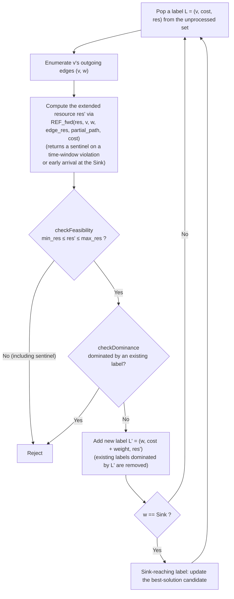

# Writing a Python Resource Extension Function in cspy — A Teaching Guide Built on TSPTW

Code: [`tsptw_cspy.py`](./tsptw_cspy.py)

Audience: students and researchers who know the basics of operations research
(shortest paths, dynamic programming, branch and bound, linear programming
duality) but who are new to cspy, to labelling algorithms, and to the
elementary shortest path problem with resource constraints (ESPPRC).

Prerequisites: Section 1 (notation and glossary) and Section 2 (the resource
constrained shortest path problem) of
[`FORMULATIONS.md`](./FORMULATIONS.md). Section 4 there states the model this
guide implements.

Environment: `cspy` v1.0.3 (the C++ bindings of this fork) with `networkx` and
`numpy`, installed in the repository's `.venv`. Every console block below was
produced by running the code with that interpreter; the outputs are pasted
verbatim.

---

## 1. Purpose and how to read this guide

cspy solves the **resource constrained shortest path problem (RCSP)**: find a
minimum-weight path from a fixed origin to a fixed destination in a digraph
whose arcs consume resources, subject to bounds on the accumulated resource
values ([`FORMULATIONS.md`](./FORMULATIONS.md) Section 1.6). By default its
resources are additive: traversing an arc adds that arc's consumption. Many
useful models are not additive — a time window makes a vehicle *wait* when it
arrives early, so time propagates through a maximum, not a sum.

This guide shows how to express such a model **without modifying cspy at all**,
through its public custom **resource extension function (REF)** callback
mechanism, `cspy.REFCallback`. The worked example is the **traveling salesman
problem with time windows (TSPTW)**: find a minimum-cost tour that starts and
ends at the depot, visits every customer exactly once, and serves each customer
within its time window.

By the end you should be able to:

- carry out the reduction of TSPTW to the **elementary shortest path problem
  with resource constraints (ESPPRC)** — the RCSP restricted to paths that
  visit no vertex twice — and say precisely which cspy argument realises which
  part of the model;
- override `REFCallback.REF_fwd` to propagate time windows (waiting,
  deadlines);
- explain how the **dominance** rule of a labelling algorithm can become
  *unsound* when not every elementary path is a feasible solution, and apply
  the technique that restores soundness (the visit indicator resources);
- avoid the cspy-specific pitfalls that cost the most time in practice
  (degenerate paths, the real meaning of `min_res`, the contents of
  `partial_path`).

**This guide implements a model; it does not define one.** Every symbol, every
term and every proof it uses is defined once, normatively, in
[`FORMULATIONS.md`](./FORMULATIONS.md), and is linked from here rather than
restated. The reading path is the one stated in
[`FORMULATIONS.md`](./FORMULATIONS.md) Section 0: Section 1 (notation and
glossary) → Section 2 (the RCSP and its dynamic program) → Section 3
(per-node windows, model (P1)) → Section 4 (mandatory visits, model (P2)) →
this guide. Section 3 must not be skipped: Section 4 defines (P2) as (P1)
plus one constraint and uses (P1)'s constraint labels throughout.

Readers in a hurry can start here and follow the links backwards. Section 2
below tabulates the symbols this guide uses **in its own formulas and code**.
A handful of further symbols appear only where this guide quotes a result of
`FORMULATIONS.md` — $M^-_{ij}$ with $\bar a_i, \bar b_i$ in Section 3.3,
$L_1, L_2$ and $V(L)$ in Section 8.5, and
$\lambda_p, c_p, \pi_j, \alpha_{jp}, \bar z_p$ in Section 12.1 — and each of
those is glossed in one clause where it appears, with the normative
definition at the link given beside it.

**This is a teaching implementation.** For production work the fork provides
the same model as native C++ arguments — `time_windows=`, `service_times=`,
`require_all_visits=` — which are faster and much harder to get wrong. Section
8.6 and Section 12.2 say where to find them. The point of the exercise here is
to see *why* those arguments do what they do.

## 2. Notation used in this guide

The symbols below are defined canonically in
[`FORMULATIONS.md`](./FORMULATIONS.md) Section 1 and are repeated here, with
the code identifier each one maps to, so that the code in Sections 8 to 10 can
be read without switching documents.

**Sets, indices and the digraph.**

| Symbol | Meaning | Code |
|---|---|---|
| $n$ | the number of customers | `inst.n` (= 6) |
| $N = \{1, \dots, n\}$ | the customer set | the graph nodes other than `"Source"` and `"Sink"` |
| $o$, $d$ | the origin and the destination: the depot split into a departure copy and a return copy (Section 3.3) | the node labels `"Source"` and `"Sink"` |
| $V = \{o\} \cup N \cup \{d\}$, $A$ | the vertex set and the arc set of the search digraph | `G.nodes`, `G.edges` |
| $\sigma = (\sigma_1, \dots, \sigma_n)$ | a permutation of $N$: the order in which the customers are visited | the customer entries of `alg.path` |
| $R \subseteq N$ | the **required set**, the vertices that must be visited; here $R = N$ | — (imposed by the callback, Section 8.4) |

**Arc and vertex data.**

| Symbol | Meaning | Code |
|---|---|---|
| $t_{ij}$ | travel time on the arc from $i$ to $j$ (asymmetric here) | `inst.travel[i][j]`, and the arc attribute `res_cost[1]` |
| $w_{ij}$ | the **weight** of arc $(i,j)$: its objective coefficient. Independent of $t_{ij}$ in general; equal to it in this instance | the arc attribute `weight` |
| $a_v$ | earliest admissible service start time at $v$ | `inst.tw_a[v]`, and the node attribute `tw_a` |
| $b_v$ | latest admissible service start time at $v$ | `inst.tw_b[v]`, and the node attribute `tw_b` |
| $s_v$ | service time at $v$ (the node consumption of the time resource) | `inst.service[v]`, and the node attribute `service` |
| $H$ | the horizon: the deadline by which the path must reach the destination | `inst.horizon` (= $b_0$ = 200), passed as `max_res[1]` |

**Resources.**

| Symbol | Meaning | Code |
|---|---|---|
| $n_{\mathrm{res}}$ | the number of resources | `G.graph["n_res"]` (= $2 + n$ = 8) |
| $q_r$ | the value of resource $r$ carried by a label | `cumul_res[r]` inside the REF (before the extension), the $r$-th entry of the returned list (after), `consumed_resources[r]` at the end of the run |
| $q^{\max}_r,\ q^{\min}_r$ | the upper and lower bound on resource $r$ | `max_res[r]`, `min_res[r]` |
| $r_{\mathrm{crit}}$ | the index of the **critical resource** | `0` — here the arc counter |
| $r_{\mathrm{time}}$ | the index of the time resource | `1` |
| $T_v$ | the value of the time resource at $v$; under the time-window policy used here, the **service start time** at $v$ | `cumul_res[1]` / `consumed_resources[1]` |

**Decision variables and the objective**, used in the mixed integer program of
Section 3.3.

| Symbol | Meaning | Code |
|---|---|---|
| $x_{ij} \in \{0,1\}$ | $1$ if and only if the path uses arc $(i,j)$ | — (the model only; cspy returns the path, not $x$) |
| $z$ | the objective value, $z = \sum_{(i,j) \in A} w_{ij} x_{ij}$ | `alg.total_cost` |

Two conventions of this guide's instance are worth stating once. First,
$w_{ij} = t_{ij}$: the objective coefficient of an arc happens to equal its
travel time. They are independent data in general
([`FORMULATIONS.md`](./FORMULATIONS.md) Section 1.2), and Section 12.1 uses an
example where they differ. Second, the customers are numbered $1, \dots, n$
while resources are numbered from $0$; resource $0$ is the arc counter and
resource $1$ is time, so the first free index is $2$ and the **visit indicator
resource of customer $i$ sits at index $2 + i - 1 = i + 1$**. That offset,
written `2 + head_orig - 1` in the code, is nothing more than "skip the two
resources that are already taken".

## 3. The problem: TSPTW

### 3.1 Verbal statement and data

A vehicle leaves a depot, numbered $0$, at time $0$. It must visit each of the
customers $1, \dots, n$ exactly once and return to the depot. Travelling from
$i$ to $j$ takes $t_{ij}$ time units. Serving customer $i$ takes $s_i$ time
units and may not start before $a_i$ nor after $b_i$; a vehicle that arrives
early **waits**, a vehicle that arrives after $b_i$ is infeasible. The
objective is the total travel time. Waiting time and service time are consumed
but **not charged**.

Formally an instance is: the customer set $N = \{1, \dots, n\}$; travel times
$t_{ij} \ge 0$ for all $i \ne j$ in $\{0\} \cup N$; a time window
$[a_i, b_i]$ and a service time $s_i \ge 0$ for every $i \in N$; and the depot
data $a_0 = 0$, $s_0 = 0$ and the horizon $H = b_0$, the time by which the
vehicle must be back.

### 3.2 The sequencing model

Let $\sigma = (\sigma_1, \dots, \sigma_n)$ be a permutation of $N$, the order
in which the customers are visited, and write
$\sigma_0 = \sigma_{n+1} = 0$ for the depot at both ends. The problem is

$$
\min_{\sigma}\ \sum_{k=0}^{n} t_{\sigma_k \sigma_{k+1}}
$$

subject to the time recursion

$$
T_{\sigma_0} = 0,
\qquad
T_{\sigma_k} = \max\bigl(a_{\sigma_k},\ T_{\sigma_{k-1}} + s_{\sigma_{k-1}} +
t_{\sigma_{k-1}\sigma_k}\bigr) \;\le\; b_{\sigma_k}
\qquad (k = 1, \dots, n+1).
$$

Read the recursion in three parts.

- $T_{\sigma_{k-1}} + s_{\sigma_{k-1}} + t_{\sigma_{k-1}\sigma_k}$ is the
  **arrival time** at the $k$-th customer: start serving the previous one,
  spend $s$ there, then drive.
- The $\max$ with $a_{\sigma_k}$ is the **waiting**: arriving before the window
  opens costs nothing but does not let service start earlier.
- The $\le b_{\sigma_k}$ is the **deadline**, and it constrains the *service
  start time*, not the arrival time. (A model in which the deadline applies to
  the arrival is the `window_hard` policy of
  [`FORMULATIONS.md`](./FORMULATIONS.md) Section 3.8; it is a different
  problem.)

The permutation $\sigma$ carries the tour permutation notation of
[`FORMULATIONS.md`](./FORMULATIONS.md) Section 1.1. It is written $\sigma$ and
not $\pi$ because $\pi_j$ is reserved for the dual price that appears in
Section 12.1.

Note also that $T_v$ is **not a constant of the vertex**: it depends on where
$v$ sits in the tour. In the mixed integer program below it is therefore a
decision variable, one per vertex — which is legitimate precisely because each
vertex is visited at most once.

### 3.3 The same model as a mixed integer program

To write the model with arc variables, the depot has to be split into a
departure copy $o$ and a return copy $d$: a single vertex $0$ cannot carry both
the departure time $T_0 = 0$ and the return time. So let

$$
V = \{o\} \cup N \cup \{d\},
\qquad
A = \{(o,k) : k \in N\} \cup \{(i,j) : i \ne j \in N\} \cup \{(k,d) : k \in N\},
$$

with $t_{ok} := t_{0k}$, $t_{kd} := t_{k0}$, $a_o = 0$, $s_o = s_d = 0$,
$[a_d, b_d] = [0, H]$, and $w_{ij} = t_{ij}$ on every arc. The decision
variables are $x_{ij} \in \{0,1\}$, equal to 1 exactly when the path uses arc
$(i,j)$, and $T_i \ge 0$, the service start time at $i$. Then TSPTW is

$$
\min\ z = \sum_{(i,j) \in A} w_{ij}\, x_{ij}
$$

subject to

$$
\sum_{j\,:\,(o,j)\in A} x_{oj} = 1
\tag{B1}
$$

$$
\sum_{i\,:\,(i,d)\in A} x_{id} = 1
\tag{B2}
$$

$$
\sum_{i\,:\,(i,k)\in A} x_{ik} \;=\; \sum_{j\,:\,(k,j)\in A} x_{kj} \;\le\; 1
\qquad \forall k \in N
\tag{B3}
$$

$$
T_o = a_o = 0
\tag{B4}
$$

$$
T_j \;\ge\; T_i + s_i + t_{ij} \;-\; M^-_{ij}\,(1 - x_{ij})
\qquad \forall (i,j) \in A
\tag{B5}
$$

$$
a_j \;\le\; T_j \;\le\; \min\{b_j,\ H\}
\qquad \forall j \in V
\tag{B6}
$$

$$
\sum_{(i,j) \in A} x_{ij} \;\le\; q^{\max}_0 = n+1
\tag{B7}
$$

$$
\sum_{i\,:\,(i,k)\in A} x_{ik} \;=\; 1 \qquad \forall k \in N
\tag{C1}
$$

$$
x_{ij} \in \{0,1\},\qquad T_i \ge 0 .
\tag{B8}
$$

The constraint labels are [`FORMULATIONS.md`](./FORMULATIONS.md)'s, so the two
documents can be read side by side: (B1)–(B8) are the per-node-window model
(P1) of its Section 3.3, and (C1) with required set $R = N$ is the coverage
constraint of its Section 4.1. What each one does:

- (B1)–(B3) make $x$ the incidence vector of a path from $o$ to $d$ that visits
  each customer at most once; the $\le 1$ in (B3) is elementarity.
- (B4) fixes the departure, (B5) is the linearisation of the $\max$ in the time
  recursion — jointly with the lower bound $a_j \le T_j$ of (B6), which is the
  other half of that $\max$ — and (B6) is the window itself. The **big-M
  constant** $M^-_{ij} \ge 0$ is what switches (B5) off on an arc the path
  does not use: with $x_{ij} = 0$ the term $-M^-_{ij}(1 - x_{ij})$ must drag
  the right-hand side below anything $T_j$ could be, so that the constraint
  becomes vacuous. Writing $[\bar a_i,\ \bar b_i]$ for the range within which
  $T_i$ can move — here $\bar a_i = a_i$ and $\bar b_i = \min\{b_i, H\}$,
  except that $\bar b_o = a_o = 0$ because (B4) pins $T_o$ — the smallest
  constant that does so is
  $M^-_{ij} = \max\{0,\ \bar b_i + s_i + t_{ij} - \bar a_j\}$. It is derived,
  and shown to be smallest, in [`FORMULATIONS.md`](./FORMULATIONS.md)
  Section 3.4, which also tabulates its value on all six arcs of a small
  instance.
- (B7) bounds the number of arcs; a Hamiltonian path uses exactly $n+1$ of
  them, so the bound is tight but satisfied.
- (C1) upgrades "at most once" to "exactly once", which is what turns a
  shortest path problem into a traveling salesman problem.

Two remarks that matter when reading the solver's output later. First, (B5) and
(B6) admit **any** feasible schedule, not only the earliest one; the recursion
of Section 3.2 picks the earliest, which is what cspy reports
([`FORMULATIONS.md`](./FORMULATIONS.md) Section 3.7). Second, the formulation
needs no subtour elimination constraints: a cycle disjoint from the $o$–$d$
path would have to increase the arc counter without changing the endpoints, and
(B7) together with the resource propagation excludes it
([`FORMULATIONS.md`](./FORMULATIONS.md) Section 3.6).

## 4. Reduction to the elementary shortest path problem with resource constraints

cspy does not know about tours, depots or time windows. It searches for a
minimum-weight path from a vertex literally named `"Source"` to a vertex
literally named `"Sink"`, subject to bounds on accumulated resources. The
reduction turns each piece of Section 3 into one of those ingredients.

### 4.1 The search digraph

Use exactly the split digraph $(V, A)$ of Section 3.3: `"Source"` is $o$,
`"Sink"` is $d$, the customers keep their numbers, and every arc $(i,j)$
carries the weight $w_{ij} = t_{ij}$. Elementarity — the $\le 1$ of (B3) — is
requested with `elementary=True`, which restricts the search to **elementary
paths**, those that visit no vertex more than once.

### 4.2 The resource vector

Each label carries a resource vector of length $n_{\mathrm{res}} = 2 + n$.

| Resource | Meaning | $q^{\min}_r$ | $q^{\max}_r$ |
|---|---|---:|---:|
| $q_0$ | the arc counter: $t^{(0)}_{ij} = 1$ on every arc. This is the **critical resource**, the one the bidirectional search would use to decide where its two halves meet, so it must be monotone and additive | $0$ | $n+1 = 7$ |
| $q_1$ | time: the service start time $T_v$ at the vertex the label sits on | $0$ | $H = 200$ |
| $q_{i+1}$, $i \in N$ | the **visit indicator resource** of customer $i$: $0$ while unvisited, $-1$ once visited | $-1$ | $0$ |

The indicator of customer $i$ sits at index $2 + i - 1 = i + 1$ because indices
$0$ and $1$ are already taken (Section 2).

Only $q_0$ is propagated additively. $q_1$ is propagated by the custom resource
extension function whose interface is Section 7 and whose code is Section 9.3:
it implements $T_j = \max(a_j, T_i + s_i + t_{ij})$ and, when the deadline
$b_j$ would be exceeded, returns a **sentinel value** — a value deliberately
placed above $q^{\max}_1$, so that cspy's ordinary feasibility check rejects
the label. The indicator resources are set by the same function, from node
attributes.

The indicators are **not** what forbids visiting a customer twice; that is
`elementary=True`. Their bounds are in fact redundant as constraints, since
`elementary=True` already satisfies them
(see [`FORMULATIONS.md`](./FORMULATIONS.md) Section 4.3 for what each bound
actually imposes). They exist to make **dominance sound**, and Section 8.5
explains why that is needed at all.

### 4.3 The correspondence

**Proposition.** With the data of Section 3.3 — split depot, $w = t$,
$R = N$, $q^{\max}_0 = n+1$ — the map
$\sigma \mapsto (o, \sigma_1, \dots, \sigma_n, d)$ is a bijection between the
tours feasible for TSPTW and the elementary $o$–$d$ paths that visit every
customer and satisfy the resource bounds, and it preserves the objective
value.

The proof is [`FORMULATIONS.md`](./FORMULATIONS.md) Section 4.2. In outline:
the image of the map is exactly the set of elementary $o$–$d$ paths covering
$N$, which by (C1), (B3) and (B7) is the feasible set of the model; the time
resource obeys the same recursion as $T_\sigma$, with $T_o = a_o = 0$ matching
$T_{\sigma_0} = 0$; and the objective agrees term by term because $w = t$.

The reduction does not depend on $w = t$. Choosing $w \ne t$ keeps the same
feasible set with a different objective — "minimise distance subject to
keeping a timetable" — and Section 12.1 does exactly that with reduced costs.

### 4.4 What is asked of cspy

| Model ingredient | cspy argument | Value in this example |
|---|---|---|
| $(V, A)$ | `G` (a `networkx.DiGraph` with nodes `"Source"` and `"Sink"`) | built by `build_graph` |
| $n_{\mathrm{res}}$ | `G.graph["n_res"]` | `2 + inst.n` |
| $w_{ij}$ | the arc attribute `weight` | `float(t)` |
| $t^{(r)}_{ij}$ | the arc attribute `res_cost` (length `n_res`) | `[1.0, t, 0.0, ...]` |
| $q^{\max}$, $q^{\min}$ | `max_res`, `min_res` | `[7.0, 200.0] + [0.0] * 6`, `[0.0, 0.0] + [-1.0] * 6` |
| (B3), elementarity | `elementary=True` | — |
| (B4)–(B6), the time windows | `REF_callback=cb`, a `REFCallback` subclass | `TSPTWCallback` |
| (C1), coverage | approach (b) of Section 8.4, inside the same callback | — |
| the search direction | `direction="forward"` | see pitfall 9 of Section 11 |

$r_{\mathrm{crit}}$ stays at its default $0$. It cannot be chosen
automatically here: `find_critical_res=True` is incompatible with any resource
extension function (pitfall 2 of Section 11).

## 5. Instance C, the six-customer instance

This instance is defined canonically in
[`FORMULATIONS.md`](./FORMULATIONS.md) Section 4.8. Its data are repeated here
so that everything the solver does below can be traced by hand.

### 5.1 The data

**Travel times $t_{ij}$** (asymmetric; row $i$ = from, column $j$ = to). The
depot is vertex 0; row 0 gives the arcs out of `"Source"` and column 0 the arcs
into `"Sink"`.

| from \ to | 0 | 1 | 2 | 3 | 4 | 5 | 6 |
|---|---:|---:|---:|---:|---:|---:|---:|
| **0** | 0 | 11 | 8 | 5 | 8 | 5 | 7 |
| **1** | 9 | 0 | 7 | 12 | 3 | 11 | 7 |
| **2** | 8 | 12 | 0 | 4 | 8 | 3 | 11 |
| **3** | 3 | 4 | 10 | 0 | 8 | 3 | 8 |
| **4** | 10 | 3 | 3 | 6 | 0 | 8 | 4 |
| **5** | 5 | 8 | 5 | 12 | 4 | 0 | 10 |
| **6** | 8 | 4 | 7 | 5 | 12 | 4 | 0 |

**Vertex data.**

| vertex $v$ | $a_v$ | $b_v$ | $s_v$ |
|---|---:|---:|---:|
| 0 (the depot, split into $o$ and $d$) | 0 | 200 | 0 |
| 1 | 39 | 59 | 6 |
| 2 | 2 | 18 | 2 |
| 3 | 38 | 60 | 4 |
| 4 | 32 | 57 | 5 |
| 5 | 2 | 13 | 3 |
| 6 | 42 | 60 | 1 |

The horizon is $H = b_0 = 200$, so it is not binding; the customers' windows
are.

### 5.2 How the instance was built

The travel times, windows and service times were chosen by a seed search
followed by exhaustive evaluation of all $6! = 720$ customer orders with exact
rational arithmetic, keeping only instances in which **windows, waiting and
service times are all three binding at once**. The result is a very tight
instance: of the 720 orders, only **4** are feasible.

### 5.3 The optimum, before any solver is run

| rank | order $\sigma$ | cost | total wait | return time |
|---|---|---:|---:|---:|
| 1 | 2, 5, 4, 1, 6, 3 | **33** | 12 | 66 |
| 2 | 5, 2, 4, 1, 6, 3 | 36 | 9 | 66 |
| 3 | 2, 5, 4, 6, 3, 1 | 37 | 13 | 71 |
| 4 | 5, 2, 4, 6, 3, 1 | 40 | 10 | 71 |

So the answer is known in advance: the unique optimum is
$0 \to 2 \to 5 \to 4 \to 1 \to 6 \to 3 \to 0$, that is the path
$P = (o, 2, 5, 4, 1, 6, 3, d)$, of cost $z^{*} = 33$, ending with
$q = (7, 66)$ — seven arcs and a depot return at time 66. Its schedule,
obtained from the recursion of Section 3.2, is what the solver must reproduce:

| vertex | window | $s_v$ | arrival | wait | $T_v$ | departure $T_v + s_v$ |
|---|---|---:|---:|---:|---:|---:|
| $o$ | $[0, 200]$ | 0 | 0 | 0 | 0 | 0 |
| 2 | $[2, 18]$ | 2 | 8 | 0 | 8 | 10 |
| 5 | $[2, 13]$ | 3 | 13 | 0 | 13 | 16 |
| 4 | $[32, 57]$ | 5 | 20 | 12 | 32 | 37 |
| 1 | $[39, 59]$ | 6 | 40 | 0 | 40 | 46 |
| 6 | $[42, 60]$ | 1 | 53 | 0 | 53 | 54 |
| 3 | $[38, 60]$ | 4 | 59 | 0 | 59 | 63 |
| $d$ | $[0, 200]$ | 0 | 66 | 0 | 66 | 66 |

Trace two rows to see the recursion at work; every number comes from the two
tables above and nowhere else.

**Row 5 → row 4 (waiting).** The label sits at customer 5 with service start
time $T_5 = 13$, and $s_5 = 3$ from the vertex table, so it departs at $16$.
Row 5 of the travel-time matrix gives $t_{54} = 4$. The arrival at customer 4
is therefore

$$
T_5 + s_5 + t_{54} \;=\; 13 + 3 + 4 \;=\; 20 .
$$

But $a_4 = 32$, so $T_4 = \max(a_4,\ 20) = \max(32,\ 20) = 32$: the vehicle
waits $32 - 20 = 12$ units, which is the `wait` entry of row 4. The cost is
unaffected, because waiting is free.

**Row 4 → row 1 (no waiting).** From $T_4 = 32$ with $s_4 = 5$ and
$t_{41} = 3$, the arrival at customer 1 is $32 + 5 + 3 = 40$. Here
$a_1 = 39 \le 40$, so the $\max$ does nothing and $T_1 = 40$, with no wait —
and $40 \le b_1 = 59$, so the deadline is met.

### 5.4 Why the instance is designed this way

Three properties, each checked at run time by the verification harness of
Section 9.6:

- **Windows are binding (V3).** Ignoring the windows, the optimal tour is
  $0 \to 6 \to 1 \to 4 \to 2 \to 3 \to 5 \to 0$ with cost 29, and that tour is
  infeasible once the windows are imposed. The gap $33 - 29 = 4$ is caused by
  the windows alone.
- **Waiting occurs (V4).** The optimum waits 12 units at customer 4, and it
  arrives at customer 5 exactly at its deadline $b_5 = 13$, so that window is
  tight in the other direction too.
- **Service times are binding (V5).** Replacing every service time by the
  constant 3 changes the optimal order and makes the original order
  infeasible.

## 6. cspy's labelling algorithm

`BiDirectional` solves the RCSP with a **labelling algorithm**: a dynamic
programming method that keeps several labels per vertex, one per non-dominated
combination of resources, and repeatedly extends them along outgoing arcs
([`FORMULATIONS.md`](./FORMULATIONS.md) Section 1.6). The formal dynamic
program — initial label, extension, feasibility, dominance, recursion — is
Section 2.4 there. The vocabulary, defined once here:

- A **label** is a partial path from the origin to some vertex, together with
  the weight and the resource vector it has accumulated. Where Dijkstra's
  algorithm keeps one distance per vertex, a labelling algorithm keeps many
  labels per vertex, because a cheaper partial path may have consumed more of
  some resource and be useless later.
- An **extension** stretches a label along one outgoing arc $(v, u)$ and
  computes the resource vector of the result. That computation is exactly the
  **resource extension function**. By default it is additive — it adds the
  arc's `res_cost`. Subclassing `REFCallback` and overriding `REF_fwd`
  substitutes a non-additive rule such as
  $T_j = \max(a_j, T_i + s_i + t_{ij})$. The Python method is called from the
  C++ search loop through the SWIG director mechanism, once per attempted
  extension.
- The **feasibility check** tests $q^{\min} \le q \le q^{\max}$ on the
  extended vector. A resource extension function has no way to say "reject"
  directly, so it rejects by returning a **sentinel value**: a value
  deliberately outside the bounds, here `horizon + 1000`, which fails this very
  check.
- **Dominance** discards a label $L_2$ because another label $L_1$ at the same
  vertex has no larger weight, no larger value in every resource, and — under
  `elementary=True` — an unreachable set contained in $L_2$'s (the condition of
  Feillet et al. 2004). This is what keeps the search tractable.
- **Soundness** of a pruning or dominance rule is the property that it never
  discards a label that could have led to an optimal solution. Dominance is
  sound when $L_1$ can reproduce every feasible completion of $L_2$. Section 8
  is about what happens when that premise fails.
- The **halfway point** is the value of the critical resource at which a
  **bidirectional search** (`direction="both"`) stops extending and starts
  joining forward and backward labels. This example runs
  `direction="forward"`, a **monodirectional search**, so no such cut-off
  fires — but the critical resource is still special, as Section 8.2 shows.

The flow of one extension. The **unprocessed set** named in the first box is
the collection of labels that have been generated but not yet extended — the
labelling algorithm's analogue of Dijkstra's priority queue, called the
*label heap* in [`FORMULATIONS.md`](./FORMULATIONS.md) Section 1.6. It is
ordered by resource consumption, not by cost, which is why the first complete
path the search accepts is not in general the cheapest one.



## 7. The `REFCallback` interface

In the installed package
(`.venv/lib/python3.13/site-packages/cspy/algorithms/pyBiDirectionalCpp.py`,
L530), the SWIG-generated base class declares the forward resource extension
function as follows. The argument names, spelling included, are quoted
verbatim:

```python
def REF_fwd(self, cumulative_resource, tail, head, edge_resource_consumption, partial_path, accummulated_cost):
```

The call is positional, so a subclass may rename the arguments. This example
uses:

```python
    def REF_fwd(self, cumul_res: Sequence[float], tail: int, head: int,
                edge_res: Sequence[float], partial_path: Sequence[int],
                cumul_cost: float) -> list[float]:
```

| Argument | Contents |
|---|---|
| `cumul_res` | the resource vector $q$ on arrival at `tail`, i.e. the label *before* the extension |
| `tail`, `head` | cspy's **internal integer node identifiers**, not the original names (mapping back is described below) |
| `edge_res` | the `res_cost` array of the arc being traversed |
| `partial_path` | the partial path *before* the extension (a sequence of internal integer identifiers; **`head` is not included**) |
| `cumul_cost` | the accumulated `weight` $z(L)$ on arrival at `tail` (unused in this example) |
| return value | the resource vector $q'$ after the extension: a `list[float]` of length $n_{\mathrm{res}}$ |

**Rejection is expressed by returning a sentinel, never by raising.** There is
no "reject" return value, and raising is not an alternative: an exception
raised inside the callback propagates out through the director and aborts the
entire `run()`, rather than rejecting the one label that triggered it.

**The graph injection idiom.** cspy relabels the graph's nodes to consecutive
integers internally, so `tail` and `head` are integers even when the original
nodes are `"Source"` and `1..n`. To read node attributes such as `tw_a`, the
callback needs that relabelled graph, which only exists after `BiDirectional`
has been constructed. The official idiom (see `test/python/tests_issue32.py` in
the repository) is to inject it afterwards:

```python
    alg = BiDirectional(G, max_res, min_res, direction="forward",
                        elementary=True, REF_callback=cb)
    cb.G = alg.G          # inject the graph with internal IDs into the REF (required)
```

Node attributes carry over unchanged, and each node keeps an `original_label`
attribute mapping back to its original name (`"Source"`, `1..n`, `"Sink"`).
Forgetting the injection makes every attribute lookup inside `REF_fwd` fail.

## 8. Enforcing full coverage

Elementarity says "at most once". TSPTW needs "exactly once", constraint (C1).
This section is the heart of the exercise: it shows one approach that does not
work and one that does, and it explains why the obvious resource encoding is
not enough on its own.

**A note on the demonstrations.** Everything asserted here is checked at run
time. `tsptw_cspy.py --verify` runs eight checks, V1 to V8; V6, V7 and V8 are
the three demonstrations cited below, and their verbatim output is in
Section 10.

### 8.1 Why `elementary=True` alone is not enough

A path that skips customers is shorter, so a plain shortest path search takes
it. Solving with no coverage enforcement at all returns

```text
path=['Source', 3, 'Sink'] cost=8 (customers visited 1/6)
```

(V6): go to customer 3 and come straight back, for $5 + 3 = 8$, against the
optimum's 33. Nothing in the resource bounds forbids it.

### 8.2 Approach (a): impose `min_res[0] = n+1` — does not work

The arc counter $q_0$ equals $n+1$ exactly on a Hamiltonian path, so
$q^{\min}_0 = n+1$ looks like the natural way to demand one. It is not, and the
reason is a genuine subtlety of the implementation rather than a bug.

For the **critical resource**, `min_res` is not a lower bound imposed at the
destination. It is the **floor of the halfway point** of the bidirectional
search: `updateHalfWayPoints` in `src/cc/bidirectional.cc` only ever raises
`min_res_curr_`, monotonically, as the search proceeds. And `checkFeasibility`
in `src/cc/labelling.cc` compares the critical resource against that value at
**every** extension, unconditionally
([`FORMULATIONS.md`](./FORMULATIONS.md) Section 4.6 tabulates exactly which
bounds are checked when).

So with $q^{\min}_0 = 7$ the very first label — one arc out of `"Source"`, with
$q_0 = 1 < 7$ — is already infeasible. Every label dies at birth and the search
returns the **degenerate path** `['Source']` immediately: the result cspy
returns instead of raising when no complete path was accepted. That is V7:

```text
solve_tsptw(enforce='min_res_critical') -> None (degenerate path)
```

### 8.3 Reconciling an apparent contradiction

If the halfway point only matters to the bidirectional search, why does this
example — which runs `direction="forward"` throughout — suffer at all?

Because the two mechanisms are separate. The halfway-point **cut-off** (stop
extending, start joining) lives in `checkBounds`, which returns `true` only
when `params.direction == BOTH`, so it never fires here. But
`updateHalfWayPoints` is called from `move()` on **every** processed label,
whatever the direction, and the **comparison** of the critical resource
against the running `min_res_curr_` happens in `checkFeasibility` at every
extension, also whatever the direction. So `min_res_curr_[0]` does creep
upward in a forward-only run too, exactly as
[`FORMULATIONS.md`](./FORMULATIONS.md) Section 4.6 says; it simply cannot
matter here, because approach (a) sets $q^{\min}_0 = q^{\max}_0 = 7$ and a
value pinned between two equal bounds has nowhere to move. Every label whose
arc count is below 7 is rejected from the first extension onwards, which is
why approach (a) kills every label instead of merely being ineffective.

### 8.4 Approach (b): reject early arrivals at the destination — adopted

`REF_fwd` receives `partial_path`, the partial path *before* the extension.
When the label is about to enter `"Sink"` and has already visited all
customers, that path contains `"Source"` plus $n$ customers, i.e. $n+1$
vertices. So:

> if `head` is `"Sink"` and `len(partial_path) < n + 1`, return a sentinel for
> the time resource.

The label is then rejected by the ordinary feasibility check, and only
Hamiltonian paths can reach the destination. This is adopted here because it
stays entirely inside the public interface of the resource extension function
and depends on no internal semantics — no halfway points, no soft checks.

### 8.5 The visit indicator resources, and why dominance needs them

Coverage is now enforced, but the search still returns nothing. Dropping the
indicator resources (running with $n_{\mathrm{res}} = 2$) gives, on an instance
whose optimum demonstrably exists, V8:

```text
solve_tsptw(use_flags=False) -> None (degenerate path)
```

The cause is unsound **dominance**. Under `elementary=True`, cspy's rule
discards $L_2$ when $L_1$ has no larger weight, no larger resources, and an
unreachable set contained in $L_2$'s. That rule is sound **whenever every
elementary path is a feasible solution**, because then any completion of $L_2$
is also a completion of $L_1$. Under coverage that premise fails: a completion
must also cover the customers $L_2$ has already visited and $L_1$ has not.

Concretely, a cheap label that has visited only $\{3\}$ can dominate a label
that has visited $\{2, 5, 3\}$ — same vertex, lower cost, lower arc count,
containment satisfied. But only the second one can still be completed into a
Hamiltonian path within the windows. Dominance throws away the only survivor,
and the search ends with nothing.

The fix is to put the visited set into the resource vector in a direction that
makes the component-wise comparison work for us: **decrement** the indicator of
customer $i$ from $0$ to $-1$ on visiting it.

Two pieces of notation for the argument, both from
[`FORMULATIONS.md`](./FORMULATIONS.md) Section 1: $L_1$ and $L_2$ are the two
labels being compared, $L_1$ the candidate winner and $L_2$ the one that
would be discarded, and $V(L)$ is the **visited set** of a label $L$, the set
of vertices on its partial path. Then "$q(L_1) \le q(L_2)$ component-wise",
read on the indicator entries alone, says

$$
V(L_1) \cap N \;\supseteq\; V(L_2) \cap N
$$

— the winner must have visited at least everything the loser did. Read on
entry $0$ instead, the same condition says $q_0(L_1) \le q_0(L_2)$, and since
`res_cost[0]` is $1$ on every arc that is
$\lvert V(L_1) \rvert \le \lvert V(L_2) \rvert$ for two labels at the same
vertex. A superset of no larger size is equal, so the two together force the
visited sets to **coincide**. Domination by a proper subset, the failure
above, is gone.

Note that it is the arc counter, not the elementary unreachable-set
condition, that supplies the second half: the unreachable set contains the
visited set and grows past it as soon as one extension has been rejected, so
containment of unreachable sets does not by itself bound the visited sets.

The direction is essential. Incrementing $0 \to +1$ instead flips the inclusion
to $\subseteq$ and leaves in place exactly the case one is trying to remove.

The formal statement — what each bound actually imposes, why the indicators are
redundant as constraints but not as dominance restrictions, and the soundness
proof — is [`FORMULATIONS.md`](./FORMULATIONS.md) Sections 4.3 and 4.4. The
underlying elementary dominance rule is that of Feillet et al. (2004), listed
in Section 13.

### 8.6 The fork's built-in alternative: `require_all_visits`

**This fork offers the same fix as a built-in option.** Passing
`require_all_visits=True` (with `elementary=True` and `direction='forward'`)
makes the engine itself require that two labels visit exactly the same required
nodes before one may dominate the other, and refuse any extension into the
`Sink` from a label that has not yet visited them all. It is the same pruning
rule as the visit indicators — the visited set is simply held as a bit set on
the label instead of being spelled out as one resource per customer — so the
resource vector stays at $n_{\mathrm{res}} = 2$ and no `res_cost` array has to
be widened.

This teaching example keeps the hand-built indicator encoding, because seeing
*why* it works is the point of the exercise; for production use prefer the
option. Its interface and restrictions are in
[`NATIVE_TW_GUIDE.md`](./NATIVE_TW_GUIDE.md) Section 6, *Mandatory visits*; the
proof that the two encodings are the same pruning rule, and the measured cost
of the difference, are [`FORMULATIONS.md`](./FORMULATIONS.md) Sections 4.4 and
4.5.

## 9. Code walkthrough of `tsptw_cspy.py`

The file is written to be read in the order (1) instance → (2) callback →
(3) graph construction → (4) solving → (5) verification. Each excerpt below is
quoted from the file and preceded by the part of Sections 4 to 8 it
implements.

### 9.1 The instance

*Implements: the data of Section 5.1.* Index 0 is the depot; `horizon` is the
property $H = b_0$.

```python
INSTANCE = TSPTWInstance(
    n=6,
    travel=(
        # 0   1   2   3   4   5   6
        (0, 11,  8,  5,  8,  5,  7),   # from 0 (depot)
        (9,  0,  7, 12,  3, 11,  7),   # from 1
        (8, 12,  0,  4,  8,  3, 11),   # from 2
        (3,  4, 10,  0,  8,  3,  8),   # from 3
        (10, 3,  3,  6,  0,  8,  4),   # from 4
        (5,  8,  5, 12,  4,  0, 10),   # from 5
        (8,  4,  7,  5, 12,  4,  0),   # from 6
    ),
    tw_a=(0, 39, 2, 38, 32, 2, 42),
    tw_b=(200, 59, 18, 60, 57, 13, 60),
    service=(0, 6, 2, 4, 5, 3, 1),
)
```

### 9.2 The callback constructor and the sentinel

*Implements: the sentinel of Section 6 and the graph injection of Section 7.*

```python
    def __init__(self, inst: TSPTWInstance, enforce_hamiltonian: bool = True,
                 use_flags: bool = True):
        REFCallback.__init__(self)
        # cspy internally works with a graph whose nodes have been
        # converted to integer IDs, so alg.G must be injected here after
        # the BiDirectional object is constructed (the official idiom; see
        # test/python/tests_issue32.py). Node attributes carry over
        # unchanged, and the original_label attribute maps back to the
        # original node name ("Source"/1..n/"Sink").
        self.G: Optional[nx.DiGraph] = None
        self._n = inst.n
        # Returning a value exceeding max_res[1] (= horizon) makes
        # checkFeasibility reject the label
        self._inf = float(inst.horizon) + 1000.0
        self._enforce = enforce_hamiltonian
        self._use_flags = use_flags
```

### 9.3 `REF_fwd`

*Implements: the time recursion of Section 3.2, the visit indicators of
Section 8.5, and approach (b) of Section 8.4.* The symbol-to-code
correspondence is written inline, comment by comment.

```python
        new = list(cumul_res)

        # --- res[0]: edge-count counter (critical resource, res_cost[0]=1 on every edge) ---
        new[0] += edge_res[0]

        nd_tail = self.G.nodes[tail]
        nd_head = self.G.nodes[head]
        head_orig = nd_head["original_label"]   # original node name (int or str)

        # --- res[2+i-1]: visit flag for customer i, 0 -> -1 ---
        # A resource that restricts dominance to labels whose visited sets
        # coincide exactly. See the module docstring for details.
        # use_flags=False demonstrates the resulting unsoundness (V8).
        if self._use_flags and isinstance(head_orig, int):
            new[2 + head_orig - 1] = cumul_res[2 + head_orig - 1] - 1.0

        # --- Enforcing Hamiltonicity (approach (b), the one adopted) ---
        # partial_path is the partial path *before* extension (head is not
        # included). Once all customers have been visited, it must contain
        # Source + n customers = n+1 nodes, so reject with a sentinel any
        # label that reaches the Sink before that.
        if (self._enforce and head_orig == "Sink"
                and len(partial_path) < self._n + 1):
            new[1] = self._inf
            return new

        # --- res[1]: time propagation  T_new = max(a_head, T + s_tail + t_edge) ---
        #   T          = cumul_res[1]        (service start time at tail)
        #   s_tail     = nd_tail["service"]  (service time at tail)
        #   t_edge     = edge_res[1]         (travel time on the edge)
        #   a_head     = nd_head["tw_a"]     (wait until a_head if early)
        # This instance has a_Source=0, so tail==Source needs no special
        # handling here (note that an instance with a_Source>0 would need
        # to adjust the initial time).
        arrival = cumul_res[1] + nd_tail["service"] + edge_res[1]
        start = max(nd_head["tw_a"], arrival)
        # Above b_head: return a sentinel (checkFeasibility rejects it for us)
        new[1] = start if start <= nd_head["tw_b"] + TOL else self._inf
        return new
```

`TOL` is the module-level constant `1e-9`, the slack allowed when comparing a
computed start time against the deadline $b_j$. It guards against a start time
that is mathematically equal to $b_j$ being rejected because floating-point
addition landed one unit in the last place above it. All data in this instance
are integers, so it never changes an outcome here; it matters as soon as
travel times or windows are fractional.

### 9.4 Graph construction

*Implements: the search digraph of Section 4.1 and the resource vector of
Section 4.2.* Time windows and service times are carried as **node
attributes**, because a resource extension function is given vertices and one
arc, not the instance.

```python
    n_res = (2 + inst.n) if use_flags else 2
    # Note: the directed=True kwarg seen in nx.DiGraph(directed=True, ...)
    # in cspy's official examples is just a plain graph attribute that
    # neither networkx nor cspy reads, so it is omitted here.
    G = nx.DiGraph(n_res=n_res)

    # Nodes: carry time windows and service time as attributes (read by the REF)
    G.add_node("Source", tw_a=0.0, tw_b=float(inst.horizon), service=0.0)
    G.add_node("Sink", tw_a=0.0, tw_b=float(inst.horizon), service=0.0)
    for i in range(1, inst.n + 1):
        G.add_node(i, tw_a=float(inst.tw_a[i]), tw_b=float(inst.tw_b[i]),
                   service=float(inst.service[i]))

    def res_cost(t: int) -> np.ndarray:
        return np.array([1.0, float(t)] + [0.0] * (n_res - 2))

    for i in range(1, inst.n + 1):
        t = inst.travel[0][i]
        G.add_edge("Source", i, res_cost=res_cost(t), weight=float(t))
        t = inst.travel[i][0]
        G.add_edge(i, "Sink", res_cost=res_cost(t), weight=float(t))
        for j in range(1, inst.n + 1):
            if i != j:
                t = inst.travel[i][j]
                G.add_edge(i, j, res_cost=res_cost(t), weight=float(t))
    return G
```

What the two arc attributes hold:

- `res_cost[0] = 1` is $t^{(0)}_{ij}$, the arc counter, added by the resource
  extension function as `edge_res[0]`;
- `res_cost[1] = t` is the travel time $t_{ij}$, read as `edge_res[1]`;
- `res_cost[2..] = 0` are placeholders for the indicator resources. The
  resource extension function sets those from node attributes, so these entries
  are never read — but the array length must still equal $n_{\mathrm{res}}$
  (pitfall 5 of Section 11).
- `weight` is $w_{ij}$, the objective coefficient, here equal to $t_{ij}$.

### 9.5 Solving and extracting the solution

*Implements: the argument map of Section 4.4.*

```python
    G = build_graph(inst, use_flags=use_flags)
    # Resource bounds. res[0] goes up to exactly n+1 edges; res[1] up to
    # horizon. The visit flags range over [-1, 0] (a second visit is
    # already prevented by elementary=True).
    n_flags = inst.n if use_flags else 0
    max_res = [float(inst.n + 1), float(inst.horizon)] + [0.0] * n_flags
    min_res = [0.0, 0.0] + [-1.0] * n_flags
    if enforce == "min_res_critical":
        min_res[0] = float(inst.n + 1)

    cb = TSPTWCallback(inst, enforce_hamiltonian=(enforce == "sentinel"),
                       use_flags=use_flags)
    # Note: REF_callback cannot be combined with find_critical_res=True.
    #       Also, the prune_graph preprocessing step is always skipped.
    alg = BiDirectional(G, max_res, min_res, direction="forward",
                        elementary=True, REF_callback=cb)
    cb.G = alg.G          # inject the graph with internal IDs into the REF (required)
    alg.run()

    path = alg.path
    # Gotcha: when infeasible, cspy returns the degenerate path ['Source']
    # instead of raising an exception
    if not path or path[-1] != "Sink":
        return None
    schedule, total_wait = compute_schedule(inst, path)
    return Solution(tour=path, cost=alg.total_cost,
                    consumed=list(alg.consumed_resources),
                    schedule=schedule, total_wait=total_wait)
```

Four things to carry away:

- The combination `direction="forward"`, `elementary=True`, `REF_callback=cb`
  is what makes the model of Section 4 the one actually solved.
- **`cb.G = alg.G` is mandatory.** Without it every node-attribute lookup
  inside `REF_fwd` fails.
- Results are read from `alg.path` (original node names), `alg.total_cost`
  ($z$) and `alg.consumed_resources` ($q$ at the end of the path).
- **The degenerate-path check is mandatory.** cspy does not raise on
  infeasibility; it returns `['Source']` under a forward search. Testing
  `path[-1] != "Sink"` is the only way to tell (pitfall 3 of Section 11).

Note that the schedule printed later is *not* taken from cspy's internal
values: `compute_schedule` re-simulates the returned tour in integer
arithmetic. That independence is what makes the printed table evidence rather
than an echo.

### 9.6 What `--verify` checks

| Check | What it asserts |
|---|---|
| V1 | cspy's tour and cost equal the exhaustive optimum over all $6! = 720$ orders, computed with `Fraction` arithmetic |
| V2 | cspy's `consumed_resources[1]` equals the exhaustively computed depot return time |
| V3 | the time windows are binding (Section 5.4) |
| V4 | waiting occurs in the optimal tour (Section 5.4) |
| V5 | service times are binding (Section 5.4) |
| V6 | without coverage enforcement, a shorter customer-skipping path is returned (Section 8.1) |
| V7 | approach (a), `min_res[0] = n+1`, yields the degenerate path (Section 8.2) |
| V8 | without the indicator resources, dominance is unsound and no solution is found (Section 8.5) |

When experimenting with modifications, confirm that `--verify` still reports
8/8 PASS before trusting anything else.

## 10. Running it, and the verified output

The interpreter of the repository's `.venv` is used directly; no activation is
needed. From the `tsptw_example/` directory:

```console
$ ../.venv/bin/python3 tsptw_cspy.py              # normal solve
$ ../.venv/bin/python3 tsptw_cspy.py --verify     # exhaustive cross-check + design demonstrations (8 items)
$ ../.venv/bin/python3 tsptw_cspy.py --infeasible # demo of infeasible-instance handling
```

### Normal mode (actual output)

```text
Optimal tour   : Source -> 2 -> 5 -> 4 -> 1 -> 6 -> 3 -> Sink
Total travel time : 33   Total wait time : 12
Consumed resources : edges=7, depot return (service start) time=66

  Node     Window  Service Arrive   Wait  Start Depart
Source    [0,200]        0      0      0      0      0
     2     [2,18]        2      8      0      8     10
     5     [2,13]        3     13      0     13     16
     4    [32,57]        5     20     12     32     37
     1    [39,59]        6     40      0     40     46
     6    [42,60]        1     53      0     53     54
     3    [38,60]        4     59      0     59     63
  Sink    [0,200]        0     66      0     66     66
```

This is exactly the tour and schedule predicted in Section 5.3, row for row.
How to read it: each row gives that vertex's arrival time (before waiting), the
wait, the service start time $T_v$, and the departure $T_v + s_v$. Customer 5
arrives exactly at its deadline $b_5 = 13$; customer 4 is reached at 20 and
waits 12 until $a_4 = 32$. "Consumed resources" is cspy's
`consumed_resources`, from which one reads $q_0 = 7$ (the arc count $n+1$) and
$q_1 = 66$ (the depot return time) — the vector $q = (7, 66)$ of Section 5.3.

### `--verify` (actual output)

```text
PASS | V1: cspy == exhaustive exact solution (6!=720 permutations)
     cspy: ['Source', 2, 5, 4, 1, 6, 3, 'Sink'] cost=33 / brute force: ['Source', 2, 5, 4, 1, 6, 3, 'Sink'] cost=33

PASS | V2: depot return time matches
     cspy res[1]=66 / brute force=66

PASS | V3: time windows are binding
     TW-free: 0-6-1-4-2-3-5-0 cost=29 (infeasible under TW=True) / with TW: cost=33

PASS | V4: waiting (early arrival) occurs in the optimal tour
     total wait=12 (locations: [('4', 12)])

PASS | V5: service time affects the solution (s≡3 changes the optimal order)
     s≡3: ['Source', 5, 2, 3, 1, 4, 6, 'Sink'] cost=33 (the original optimal order is infeasible under s≡3=True)

PASS | V6: no enforcement -> shorter path that skips customers
     path=['Source', 3, 'Sink'] cost=8 (customers visited 1/6)

PASS | V7: approach (a) min_res[0]=n+1 does not work (-> approach (b) adopted)
     solve_tsptw(enforce='min_res_critical') -> None (degenerate path)

PASS | V8: without flags (n_res=2) there is no solution (demonstrates unsound dominance)
     solve_tsptw(use_flags=False) -> None (degenerate path)

============================================================
Verification result: 8/8 PASS
```

### `--infeasible` (actual output)

```text
Infeasible instance: customer 2's time window changed to [2, 6] (even a direct trip from the depot arrives at 8 > 6)
=> solve_tsptw returned None (cspy's degenerate path detected). Confirmed 0/720 feasible permutations by brute force as well.
```

In every mode the exit code is 0 on normal completion, and 1 if verification
fails or an unexpected result occurs.

## 11. Pitfalls and caveats

The caveats that matter when writing a custom resource extension function for
cspy, in the order in which they tend to bite.

1. **An instance with $a_o > 0$ needs special handling at `tail == Source`.**
   cspy always starts a forward label with a resource vector of zeros. Here
   $a_0 = 0$, so nothing is needed; when the depot's earliest departure time is
   positive, failing to clamp the initial time in `REF_fwd` silently propagates
   a departure at time 0.
2. **`find_critical_res=True` cannot be combined with a custom resource
   extension function.** Design the critical resource yourself — $q_0$, the arc
   counter, here — and place it first.
3. **Infeasibility raises nothing; it returns the degenerate path
   `['Source']`.** Checking `path[-1] == "Sink"` before using `alg.path` is
   mandatory. Confirm the behaviour with `--infeasible`.
4. **`prune_graph` preprocessing is always skipped when `REF_callback` is
   given.** If the graph needs contracting beforehand, do it yourself.
5. **Every arc needs both `res_cost` (of length $n_{\mathrm{res}}$) and
   `weight`.** A numpy array is recommended for `res_cost`: `BiDirectional`
   only checks the length and accepts a list, but other algorithms check the
   `ndarray` type (`checking.py`, `_check_edge_attr`). With a resource
   extension function the contents may be placeholders, but the length must
   match.
6. **`partial_path` is the partial path *before* the extension** (a sequence of
   internal integer identifiers, with `head` excluded). Approach (b) of
   Section 8.4 depends on exactly this: `len(partial_path) < n + 1`.
7. **`cumul_cost` is passed even if unused.** SWIG calls with six positional
   arguments, so the signature must accept all six.
8. **`min_res` on the critical resource is not a lower bound at the
   destination.** It is the floor of the bidirectional halfway point and is
   compared at every extension, so imposing it as if it were a constraint kills
   every label instantly — Sections 8.2 and 8.3, and
   [`FORMULATIONS.md`](./FORMULATIONS.md) Section 4.6 for the full table of
   when each bound is checked.
9. **`direction='forward'` is recommended.** `'both'` needs consistent
   `REF_bwd` and `REF_join` implementations of your own. Worse, using `'both'`
   *without* defining `REF_bwd` raises no error: cspy keeps extending backward
   with the C++ default resource extension function (adding `res_cost` for
   non-critical resources and subtracting it for the critical one,
   `additiveBackwardREF` in `src/cc/ref_callback.cc`), so **a silently wrong
   solution can be returned with no warning at all**. The warning branch in
   `checking.py` `_check_REF` never fires, because the SWIG base class always
   exposes `REF_bwd` as a callable method. An upstream bug has also been
   confirmed: cspy segfaults when `min_res > 0` is additionally imposed on the
   time resource. For teaching and for pricing, forward-only is fast enough —
   and the fork's native resource extension function supplies validated
   backward and join functions if bidirectional search is really wanted
   ([`NATIVE_TW_GUIDE.md`](./NATIVE_TW_GUIDE.md) Section 3.5 for the backward
   and join formulas, Section 4 for the Python API reference).

## 12. Further topics

### 12.1 The pricing problem of column generation

Column generation is not a prerequisite of this guide, so here is the minimum
needed to see why the code above is a template for it. Five symbols appear in
this subsection and nowhere else in the guide; they are introduced as they
are used, and defined normatively in
[`FORMULATIONS.md`](./FORMULATIONS.md) Section 5.

In a **set partitioning formulation** of the vehicle routing problem with
time windows (VRPTW), let $\Omega$ be the set of all feasible routes. Each
route $p \in \Omega$ becomes one decision variable $\lambda_p \in \{0,1\}$,
equal to $1$ when that route is used, with cost $c_p$; write
$\alpha_{jp} \in \{0,1\}$ for the indicator that route $p$ visits customer
$j$. The formulation asks for the cheapest set of routes covering every
customer exactly once:

$$
\min \sum_{p \in \Omega} c_p \lambda_p
\qquad \text{s.t.} \qquad
\sum_{p \in \Omega} \alpha_{jp} \lambda_p = 1 \quad \forall j \in N .
$$

Since $\Omega$ is exponentially large, one solves a **restricted master
problem** — the same linear program over the routes generated so far — reads
off the **dual price** $\pi_j$ of each customer's covering constraint, and
looks for a route of negative **reduced cost**

$$
\bar z_p \;=\; c_p - \sum_{j \in N} \alpha_{jp}\, \pi_j .
$$

That search is the **pricing problem**, and it is an ESPPRC with time windows
— the model of this guide with a different objective. Note that $\pi$ is
reserved for the dual price throughout, which is why Section 3.2 writes a
tour permutation as $\sigma$. The full model is
[`FORMULATIONS.md`](./FORMULATIONS.md) Section 5; Desaulniers, Desrosiers and
Solomon (2005) is the textbook.

This example transfers almost unchanged. The time propagation in `REF_fwd` and
`elementary=True` are used as they are. What changes:

- (i) replace `weight` by the reduced cost $\bar c_{ij} = t_{ij} - \pi_j$,
  updating the arc attribute at every column generation iteration (note that
  $w_{ij} \ne t_{ij}$ now, and that some weights are negative);
- (ii) **drop the coverage enforcement** — equivalent to `enforce="none"` —
  because pricing looks for *any* feasible path of negative reduced cost, not
  for a Hamiltonian one;
- (iii) add whatever problem-specific resources the routes need, typically a
  capacity resource and a stopping rule.

There is a bonus. Once coverage is dropped, every elementary path is again a
feasible solution, so cspy's Feillet-style dominance is sound as it stands and
the **visit indicator resources become unnecessary** — the flip side of
Section 8.5. Dropping them shortens the resource vector and speeds the search
up. [`FORMULATIONS.md`](./FORMULATIONS.md) Section 5.4 states why coverage must
*not* be imposed in pricing.

### 12.2 Porting the resource extension function to C++

Python's `REF_fwd` is called through the SWIG director on **every** label
extension, so it becomes the bottleneck as instances grow. cspy's callback base
class is defined on the C++ side (`src/cc/ref_callback.h`,
`src/cc/ref_callback.cc`), so the same logic implemented there as a subclass of
`bidirectional::REFCallback` removes the boundary crossing entirely. The safe
workflow is the one this example followed: get correctness right in Python
first, then port.

That port already exists in this repository. `NodeWindowREF` generalises time
windows to per-node windows on any resource and is exposed through the
`time_windows=` and `service_times=` arguments.

**What the port is worth, stated carefully**, because the two effects are
easy to conflate. Removing the SWIG director — the port itself, comparing
like with like, forward search against forward search — is worth **1.7–1.9x
on small instances and 1.0–1.1x from about thirty customers up**, where the
labelling core's own dominance computation has grown to dwarf the boundary
crossing. The much larger figures quoted for this fork come from something
else: a native resource extension function supplies validated *backward* and
*join* functions, which unlocks `direction="both"`, and on pricing with a
tight capacity bound on the critical resource that is worth another two
orders of magnitude. The headline **267x** is the product of the two — a
Python forward run against a native bidirectional one — not the speed-up from
porting. See [`NATIVE_TW_GUIDE.md`](./NATIVE_TW_GUIDE.md) Sections 9.2 and
9.5 for the table both numbers are read from, the rest of that guide for the
API and the design, and [`FORMULATIONS.md`](./FORMULATIONS.md) Section 3 for
the model it implements.

## 13. References

- **cspy repository**: https://github.com/torressa/cspy — this example was
  verified against a v1.0.3 checkout of the fork
  [`Ebisaresu/cspy_for_TW`](https://github.com/Ebisaresu/cspy_for_TW).
- **cspy documentation**: https://torressa.github.io/cspy/ (buildable from
  `docs/`; `test/python/tests_issue32.py` is the official example of a custom
  resource extension function).
- D. Torres Sanchez: *cspy: A Python package with a collection of algorithms
  for the (Resource) Constrained Shortest Path problem*, Journal of Open
  Source Software, 5(49), 1655, 2020.
- G. Righini, M. Salani: *Symmetry helps: Bounded bi-directional dynamic
  programming for the elementary shortest path problem with resource
  constraints*, Discrete Optimization, 3(3), 255–273, 2006. The basis of
  cspy's bidirectional labelling algorithm (Section 6).
- D. Feillet, P. Dejax, M. Gendreau, C. Gueguen: *An exact algorithm for the
  elementary shortest path problem with resource constraints: Application to
  some vehicle routing problems*, Networks, 44(3), 216–229, 2004. The source of
  the unreachable-set containment condition of elementary dominance
  (Section 8.5).
- Y. Dumas, J. Desrosiers, E. Gelinas, M. M. Solomon: *An optimal algorithm for
  the traveling salesman problem with time windows*, Operations Research,
  43(2), 367–371, 1995. An exact dynamic programming algorithm for the problem
  of Section 3.
- G. Desaulniers, J. Desrosiers, M. M. Solomon (eds.): *Column Generation*,
  Springer, 2005. The standard reference for column generation, branch and
  price, and pricing problems (Section 12.1).
